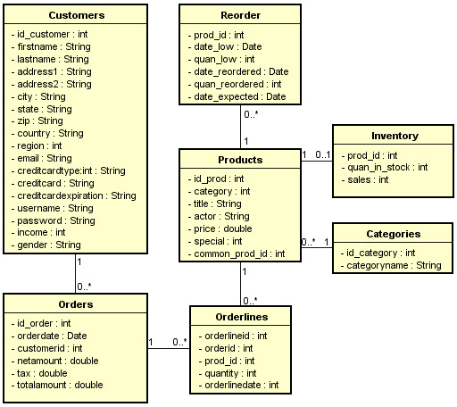

# PROJETO FINAL PARA DISCIPLINA DE PROGRAMAÇÃO EM BANCO DE DADOS

<h2> COMPONENTES DO TIME DE DESEVOLVIMENTO: </h2>
<ul>
    <li> Luiz Paulo de Lima Araújo </li>
    <li> José Edson da Silva Galdino </li>
    <li> Luigi Eduardo Silva de Lima </li>
    <li> Bartolomeu Rangel Dantas </li>
</ul>

<figure>
    
    <figcaption> Figura 01 - diagrama entidade relacionamento do projeto </figcaption>
</figure>

<h2> NO PROJETO: </h2>

<ul>
    <li> 
 6 joins 
 </li>
    <li> 
 3 functions 
 </li>
    <li> 
 3 procedures 
 </li>
    <li> 
 3 subqueries 
 </li>
    <li> 
 3 triggers 
 </li>
    <li> 
 2 views 
 </li>
    <li> 
 2 cursores 
 </li>
</ul>

